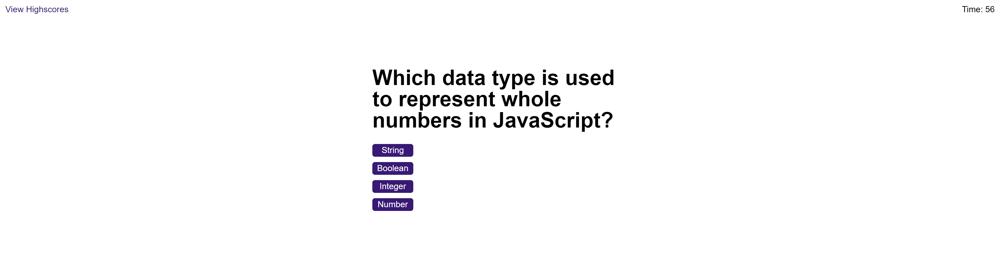

# Code Quiz
## Overview

The purpose of this project is to create a timed multiple-choice coding quiz based on the JavaScript programming language. Once the user starts the quiz, a programming-related question is pulled from a pre-defined array, and a 60 second timer is started. When the user selects the correct answer, a new question is presented. Wrong answeres are penalized by 10 seconds. The quiz ends once all questions have been answered or the timer reaches zero. The remaining time is the user's score. Users can enter their initials and save their scores to local storage. Users can view their highscores on a highscores page, and this data is saved even if the page is closed. The following steps were followed:
- Click "Start Quiz" button to start the quiz
- User is presented with a multiple choice JavaScript-related question and 60 second timer begins to count down
- User is presented with additional questions. User is notified if their selected answer is correct or incorrect 
- Once all questions have been answered, user can enter their initials and save their score
- User can click a button to play again, and save additional scores
- User can view their highscores after closing the webpage. Highscores are saved to the highscores page using client-side local storage

## Code Quiz Application

## Deployment
See it live at: https://alexlenson.github.io/Code-Quiz/

